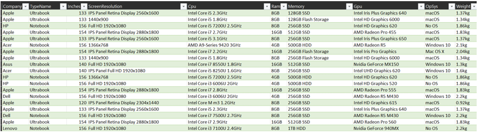
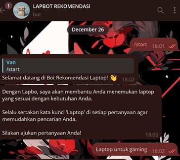
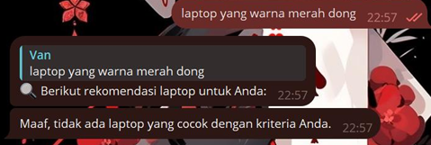

# Implementation of the TF-IDF and Cosine Similarity Methods in Telegram Bots to Support Laptop Recommendations Based on User Preferences 

TF-IDF & Cosine Similarity powered Telegram Bot

       

-Overview

This project is a **Laptop Recommendation System** implemented as a Telegram chatbot using Natural Language Processing (NLP) techniques.

It leverages:
- **TF-IDF (Term Frequency–Inverse Document Frequency)** to represent user queries and laptop specifications  
- **Cosine Similarity** to identify the most relevant laptop based on user input  

The system achieves an accuracy of approximately **80%** in answering user queries.

-Key Features
1. Telegram-based chatbot interface
2. Smart laptop recommendation based on user queries
3. NLP-powered similarity matching
4. Fast and lightweight implementation
5. Fallback response for unknown queries

-Tools & Technologies

Python, Pandas, Scikit-learn, NLTK, Telegram Bot API

-How It Works

The system processes user queries and matches them with laptop data using similarity measurement.

-Dataset

Dataset Link: https://www.kaggle.com/code/markmedhat/laptop-price-data-analysis/comments#2838660-

Source: Kaggle

Dataset: Laptop Price Dataset

Total Records: 1303 laptops

-Methods

1. TF-IDF

Used to assign weights to words based on their frequency and importance in documents.

2. Cosine Similarity

Used to measure similarity between:

User query, Laptop data

Similarity score:

Close to 1 → highly similar, Close to 0 → not similar

-Workflow

1. User inputs a query
2. Text preprocessing (tokenization & normalization)
3. TF-IDF vectorization
4. Compute Cosine Similarity
5. Retrieve top matching laptops

-Chatbot Implementation

Built using:

1. Python
2. Telegram Bot API
3. BotFather (for API token)

Features:

1. Responds to user queries
2. Provides laptop recommendations
3. Handles unknown queries with fallback responses

-Evaluation

Testing was conducted using:

10 sample queries

Results:

8 correct responses
2 incorrect responses

Accuracy: 80%

-Notes

This project demonstrates the implementation of basic NLP techniques for building a recommendation system using a chatbot interface.
