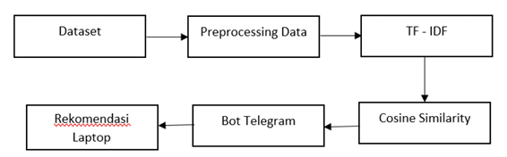

# Implementation of the TF-IDF and Cosine Similarity Methods in Telegram Bots to Support Laptop Recommendations Based on User Preferences 

TF-IDF & Cosine Similarity powered Telegram Bot

       

-Overview

This project is a Laptop Recommendation System implemented as a Telegram chatbot using Natural Language Processing techniques.

It leverages:

TF-IDF → to represent user queries and laptop specifications
Cosine Similarity → to find the most relevant laptop

The system achieves ~80% accuracy in answering user queries.

-Key Features
1. Telegram-based chatbot interface
2. Smart laptop recommendation based on user queries
3. NLP-powered similarity matching
4. Fast and lightweight implementation
5. Fallback response for unknown queries

-How It Works

